# תיעוד Backend Core - CineMate

## 🔧 הגדרות בסיסיות

### app/__init__.py - אתחול האפליקציה
```python
from flask import Flask
from flask_sqlalchemy import SQLAlchemy
from flask_login import LoginManager
from flask_mail import Mail
from flask_migrate import Migrate

db = SQLAlchemy()
login_manager = LoginManager()
mail = Mail()
migrate = Migrate()

def create_app(config_name='default'):
    app = Flask(__name__)
    
    # טעינת הגדרות
    app.config.from_object(f'config.{config_name}')
    
    # אתחול הרחבות
    db.init_app(app)
    login_manager.init_app(app)
    mail.init_app(app)
    migrate.init_app(app, db)
    
    return app
```

**הסבר מפורט על רכיבי המערכת:**
1. **הרחבות Flask הנדרשות**:
   - `SQLAlchemy`: מערכת ORM שמאפשרת לנו לעבוד עם מסד הנתונים בצורה אובייקטיבית, בלי לכתוב SQL ישירות
   - `LoginManager`: מנהל את כל תהליכי ההתחברות, ההרשאות והסשנים של המשתמשים
   - `Mail`: מערכת לשליחת אימיילים אוטומטית (למשל: איפוס סיסמה, אישורי הרשמה)
   - `Migrate`: כלי לניהול שינויים במבנה מסד הנתונים בצורה מסודרת ובטוחה

2. **תבנית Factory (יצירת האפליקציה)**:
   - יצירת אפליקציה בצורה דינמית שמאפשרת גמישות מקסימלית
   - תמיכה בסביבות עבודה שונות (פיתוח מקומי, בדיקות אוטומטיות, שרת ייצור)
   - הפרדה מוחלטת בין הגדרות המערכת לבין הקוד, מה שמקל על התחזוקה והשינויים

## 📊 מודלים ומסד נתונים

### app/models/user.py - מודל משתמש
```python
from werkzeug.security import generate_password_hash, check_password_hash
from flask_login import UserMixin
from datetime import datetime

class User(UserMixin, db.Model):
    id = db.Column(db.Integer, primary_key=True)
    username = db.Column(db.String(80), unique=True, nullable=False)
    email = db.Column(db.String(120), unique=True, nullable=False)
    password_hash = db.Column(db.String(128))
    is_admin = db.Column(db.Boolean, default=False)
    created_at = db.Column(db.DateTime, default=datetime.utcnow)
    
    # קשרים עם טבלאות אחרות
    rentals = db.relationship('Rental', backref='user', lazy=True)
    reviews = db.relationship('Review', backref='user', lazy=True)
    
    def set_password(self, password):
        self.password_hash = generate_password_hash(password)
        
    def check_password(self, password):
        return check_password_hash(self.password_hash, password)
```

**הסבר מפורט על מודל המשתמש:**
1. **שדות חובה במודל המשתמש**:
   - `username`: שם משתמש ייחודי שישמש לזיהוי המשתמש במערכת (לא ניתן לשנות)
   - `email`: כתובת אימייל ייחודית לשליחת הודעות ואיפוס סיסמה
   - `password_hash`: סיסמה מוצפנת בצורה חד כיוונית (לא ניתן לשחזר את הסיסמה המקורית)

2. **יחסים**:
   - `rentals`: קשר one-to-many עם השכרות
   - `reviews`: קשר one-to-many עם ביקורות

3. **תהליך הפעלת מיגרציה**:
   - יצירת קובץ מיגרציה: `flask db migrate -m "תיאור השינוי"`
   - בדיקת השינויים המוצעים בקובץ המיגרציה
   - הפעלת המיגרציה: `flask db upgrade`
   - במקרה של בעיה: `flask db downgrade`

### app/models/movie.py - מודל סרט
```python
class Movie(db.Model):
    id = db.Column(db.Integer, primary_key=True)
    title = db.Column(db.String(200), nullable=False)
    description = db.Column(db.Text)
    release_date = db.Column(db.Date)
    rating = db.Column(db.Float, default=0.0)
    poster_url = db.Column(db.String(200))
    
    # מטא-דאטה
    created_at = db.Column(db.DateTime, default=datetime.utcnow)
    updated_at = db.Column(db.DateTime, onupdate=datetime.utcnow)
    
    # קשרים
    rentals = db.relationship('Rental', backref='movie', lazy=True)
    reviews = db.relationship('Review', backref='movie', lazy=True)
    genres = db.relationship('Genre', secondary='movie_genres')
    
    @property
    def average_rating(self):
        if not self.reviews:
            return 0.0
        return sum(review.rating for review in self.reviews) / len(self.reviews)
```

**הסבר מפורט על מודל הסרט:**
1. **שדות המידע הבסיסיים**:
   - `title`: כותרת הסרט (חובה, עד 200 תווים)
   - `description`: תיאור מפורט של הסרט (טקסט חופשי)
   - `release_date`: תאריך הוצאת הסרט (פורמט תאריך SQL)
   - `rating`: דירוג ממוצע המחושב אוטומטית
   - `poster_url`: קישור לתמונת הפוסטר (מאוחסן בשרת חיצוני)

2. **מערכת היחסים במסד הנתונים**:
   - `genres`: קשר many-to-many עם טבלת הז'אנרים דרך טבלת קשר `movie_genres`
   - `rentals`: קשר one-to-many עם טבלת השכרות, מאפשר מעקב אחר כל השכרות של הסרט
   - `reviews`: קשר one-to-many עם טבלת הביקורות, משמש לחישוב דירוג ממוצע בזמן אמת

## 🔐 מערכת אימות

### app/auth/routes.py - ניתוב אימות
```python
@auth_bp.route('/login', methods=['GET', 'POST'])
def login():
    if current_user.is_authenticated:
        return redirect(url_for('main.home'))
        
    form = LoginForm()
    if form.validate_on_submit():
        user = User.query.filter_by(email=form.email.data).first()
        if user and user.check_password(form.password.data):
            login_user(user, remember=form.remember_me.data)
            next_page = request.args.get('next')
            return redirect(next_page or url_for('main.home'))
            
        flash('אימייל או סיסמה שגויים', 'error')
    return render_template('auth/login.html', form=form)
```

**הסבר מפורט על מערכת האימות:**
1. **תהליך התחברות משתמש**:
   - בדיקת קיום המשתמש במערכת לפי האימייל שהוזן
   - אימות הסיסמה אל מול הגרסה המוצפנת במסד הנתונים
   - יצירת סשן מאובטח עם פרטי המשתמש וההרשאות שלו
   - הפניה לדף הבא שהמשתמש ניסה לגשת אליו לפני ההתחברות

2. **אבטחה**:
   - הגנה מפני Brute Force
   - ניהול סשנים מאובטח
   - הצפנת נתונים רגישים

## 🔄 מיגרציות

### migrations/
```python
"""add_user_profile
Revision ID: 1a2b3c4d5e6f
"""
def upgrade():
    op.create_table('user_profiles',
        sa.Column('id', sa.Integer(), nullable=False),
        sa.Column('user_id', sa.Integer(), nullable=False),
        sa.Column('bio', sa.Text(), nullable=True),
        sa.Column('avatar_url', sa.String(length=200), nullable=True),
        sa.ForeignKeyConstraint(['user_id'], ['users.id'], ),
        sa.PrimaryKeyConstraint('id')
    )

def downgrade():
    op.drop_table('user_profiles')
```

**הסבר מפורט על מערכת המיגרציות:**
1. **ניהול שינויים במסד הנתונים**:
   - מעקב מסודר אחר כל שינוי במבנה מסד הנתונים (SQL Schema)
   - כל מיגרציה מקבלת מספר זיהוי ייחודי ותיאור מפורט
   - תמיכה בהחזרת שינויים (rollback) במקרה של בעיה

2. **יתרונות המערכת**:
   - שמירה על עקביות הנתונים בין כל הסביבות (פיתוח, בדיקות, ייצור)
   - עבודה בצוות מסונכרנת: כל מפתח יכול לראות את השינויים שנעשו
   - שדרוגים בטוחים: כל שינוי נבדק ומתועד לפני הפעלה
   - יכולת להחזיר שינויים במקרה של בעיה

## 📨 מערכת אימיילים

## 📨 מערכת הודעות אימייל

### 1. הגדרות המערכת (config.py)

**הסבר מפורט על הגדרות האימייל:**

```python
# הגדרות שרת האימייל
MAIL_SERVER = 'smtp.gmail.com'  # שרת SMTP של Gmail
MAIL_PORT = 587                # פורט מאובטח לשליחת אימיילים
MAIL_USE_TLS = True           # שימוש בהצפנת TLS לאבטחה
MAIL_USE_SSL = False          # לא נדרש SSL כי משתמשים ב-TLS
MAIL_USERNAME = 'your-email@gmail.com'
MAIL_PASSWORD = 'your-app-password'
MAIL_DEFAULT_SENDER = 'your-email@gmail.com'
```

**למה זה חשוב?**
- שליחת אימיילים לאיפוס סיסמה
- מענה לפניות לקוחות
- אישורי פעולות חשובות

### 2. שימוש במיילים (email_utils.py)
```python
from flask_mail import Message
from app import mail

def send_password_reset_email(user, token):
    """שליחת מייל לאיפוס סיסמה"""
    msg = Message('איפוס סיסמה - CineMate',
                 recipients=[user.email])
    msg.body = f'''לאיפוס הסיסמה שלך, לחץ על הקישור הבא:
{url_for('auth.reset_password', token=token, _external=True)}

אם לא ביקשת לאפס את הסיסמה, התעלם מהודעה זו.
'''
    mail.send(msg)

def send_contact_response(email, response):
    """שליחת תשובה לפניית לקוח"""
    msg = Message('מענה לפנייתך - CineMate',
                 recipients=[email])
    msg.body = response
    mail.send(msg)
```

### 3. תהליך איפוס סיסמה

```mermaid
graph TD
    A[משתמש מבקש איפוס] -->|שליחת טופס| B[יצירת טוקן]
    B -->|Flask-Mail| C[שליחת מייל]
    C -->|קישור| D[משתמש לוחץ]
    D -->|בדיקת טוקן| E[טופס סיסמה חדשה]
    E -->|שמירה| F[עדכון במסד נתונים]
```


## 🔑 נקודות חשובות למרצה

1. **אבטחה**:
   * הצפנת סיסמאות
   * הגנת CSRF
   * ניהול סשנים
   * סניטציה של קלט

2. **ביצועים**:
   * שימוש ב-caching
   * אופטימיזציה של שאילתות
   * שליחת מיילים אסינכרונית
   * Lazy loading של קשרים

3. **תחזוקה**:
   * מבנה מודולרי
   * תיעוד מקיף
   * מיגרציות מסודרות
   * בדיקות יחידה

# מדריך Backend למתחילים - CineMate 🎬

## 📁 מבנה הפרויקט

```
backend/
├── app/                  # תיקיית האפליקציה הראשית
│   ├── __init__.py      # אתחול האפליקציה
│   ├── models/          # הגדרות מסד הנתונים
│   ├── routes/          # ניתובים (URLs)
│   └── utils/           # פונקציות עזר
├── config.py            # הגדרות המערכת
├── migrations/          # שינויים במסד הנתונים
└── run.py              # הפעלת השרת
```

## 🚀 איך השרת עובד?

### 1. הפעלת השרת (run.py)
```python
from app import create_app
from config import Config

# יצירת אפליקציית Flask
app = create_app()

if __name__ == '__main__':
    # הפעלת השרת במצב דיבאג
    app.run(debug=True)
```

**מה קורה כאן?**
1. יוצרים אפליקציית Flask חדשה
2. טוענים את ההגדרות מ-config.py
3. מפעילים את השרת במצב דיבאג (לפיתוח)

### 2. אתחול האפליקציה (__init__.py)
```python
from flask import Flask
from flask_sqlalchemy import SQLAlchemy
from flask_login import LoginManager
from config import Config

# יצירת אובייקטים גלובליים
db = SQLAlchemy()  # חיבור למסד נתונים
login = LoginManager()  # ניהול התחברות

def create_app():
    app = Flask(__name__)
    
    # טעינת הגדרות
    app.config.from_object(Config)
    
    # אתחול הרחבות
    db.init_app(app)
    login.init_app(app)
    
    # הגדרת דף התחברות
    login.login_view = 'auth.login'
    login.login_message = 'נא להתחבר כדי לגשת לדף זה'
    
    # רישום blueprints
    from app.routes import main, auth, movies
    app.register_blueprint(main.bp)
    app.register_blueprint(auth.bp)
    app.register_blueprint(movies.bp)
    
    return app
```

**מה כל דבר עושה?**
1. **SQLAlchemy**: מאפשר לעבוד עם מסד נתונים בצורה פשוטה
2. **LoginManager**: מטפל בהתחברות והרשאות
3. **Blueprints**: מחלקים את האפליקציה לחלקים קטנים

### 3. הגדרות (config.py)
```python
import os

class Config:
    # מפתח להצפנת מידע
    SECRET_KEY = os.environ.get('SECRET_KEY') or 'מפתח-ברירת-מחדל-לפיתוח'
    
    # הגדרות מסד נתונים
    SQLALCHEMY_DATABASE_URI = os.environ.get('DATABASE_URL') or \
        'sqlite:///cinemate.db'
    SQLALCHEMY_TRACK_MODIFICATIONS = False
    
    # הגדרות אימייל
    MAIL_SERVER = 'smtp.gmail.com'
    MAIL_PORT = 587
    MAIL_USE_TLS = True
    MAIL_USERNAME = os.environ.get('MAIL_USERNAME')
    MAIL_PASSWORD = os.environ.get('MAIL_PASSWORD')
```

**למה זה חשוב?**
- מרכז את כל ההגדרות במקום אחד
- מאפשר הגדרות שונות לפיתוח וייצור
- שומר על אבטחת מידע רגיש

### 4. מודלים (models/user.py)
```python
from app import db
from werkzeug.security import generate_password_hash, check_password_hash
from flask_login import UserMixin

class User(UserMixin, db.Model):
    # שדות בטבלה
    id = db.Column(db.Integer, primary_key=True)
    username = db.Column(db.String(64), unique=True, nullable=False)
    email = db.Column(db.String(120), unique=True, nullable=False)
    password_hash = db.Column(db.String(128))
    
    # קשרים לטבלאות אחרות
    rentals = db.relationship('Rental', backref='user')
    reviews = db.relationship('Review', backref='user')
    
    def set_password(self, password):
        """הצפנת סיסמה"""
        self.password_hash = generate_password_hash(password)
    
    def check_password(self, password):
        """בדיקת סיסמה"""
        return check_password_hash(self.password_hash, password)
```

**איך זה עובד?**
1. `db.Model`: אומר ש-User הוא טבלה במסד הנתונים
2. `UserMixin`: מוסיף פונקציות להתחברות
3. `db.relationship`: יוצר קשר בין טבלאות

### 5. ניתובים (routes/auth.py)
```python
from flask import Blueprint, render_template, redirect, url_for, flash
from flask_login import login_user, logout_user, current_user
from app.models import User
from app.forms import LoginForm

bp = Blueprint('auth', __name__)

@bp.route('/login', methods=['GET', 'POST'])
def login():
    # אם המשתמש כבר מחובר
    if current_user.is_authenticated:
        return redirect(url_for('main.home'))
    
    form = LoginForm()
    if form.validate_on_submit():
        # מחפשים את המשתמש במסד הנתונים
        user = User.query.filter_by(email=form.email.data).first()
        
        # בודקים אימייל וסיסמה
        if user and user.check_password(form.password.data):
            # מחברים את המשתמש
            login_user(user, remember=form.remember_me.data)
            return redirect(url_for('main.home'))
            
        # אם הפרטים שגויים
        flash('אימייל או סיסמה לא נכונים')
    
    # מציגים את דף ההתחברות
    return render_template('auth/login.html', form=form)
```

**מה קורה כאן?**
1. `@bp.route`: מגדיר איזה URL מפעיל את הפונקציה
2. `form.validate_on_submit()`: בודק אם נשלח טופס תקין
3. `login_user`: יוצר סשן למשתמש מחובר

### 6. טפסים (forms.py)
```python
from flask_wtf import FlaskForm
from wtforms import StringField, PasswordField, BooleanField
from wtforms.validators import DataRequired, Email, Length

class LoginForm(FlaskForm):
    email = StringField('אימייל', validators=[
        DataRequired(message='חובה להזין אימייל'),
        Email(message='כתובת אימייל לא תקינה')
    ])
    
    password = PasswordField('סיסמה', validators=[
        DataRequired(message='חובה להזין סיסמה'),
        Length(min=6, message='הסיסמה חייבת להכיל לפחות 6 תווים')
    ])
    
    remember_me = BooleanField('זכור אותי')
```

**איך זה עוזר לנו?**
- בדיקת תקינות נתונים אוטומטית
- הגנה מפני CSRF
- הודעות שגיאה בעברית

## 🔄 תהליכים מרכזיים

### 1. תהליך התחברות

```mermaid
graph TD
    A[משתמש שולח טופס] -->|Flask מקבל POST| B[בדיקת תקינות טופס]
    B -->|תקין| C[חיפוש משתמש בDB]
    B -->|לא תקין| D[הצגת שגיאות]
    C -->|נמצא| E[בדיקת סיסמה]
    C -->|לא נמצא| F[הודעת שגיאה]
    E -->|תקין| G[יצירת סשן]
    E -->|לא תקין| F
```


### 2. תהליך השכרת סרט

```mermaid
graph TD
    A[בקשת השכרה] -->|בדיקת הרשאות| B{משתמש מחובר?}
    B -->|כן| C[בדיקת זמינות]
    B -->|לא| D[401 Unauthorized]
    C -->|זמין| E[יצירת רשומת השכרה]
    C -->|לא זמין| F[הודעת שגיאה]
```


## 🔗 קשרים בין מודלים

### 1. User ↔ Rental
```python
# בטבלת User
rentals = db.relationship('Rental', backref='user')

# בטבלת Rental
user_id = db.Column(db.Integer, db.ForeignKey('user.id'))
```

### 2. Movie ↔ Review
```python
# בטבלת Movie
reviews = db.relationship('Review', backref='movie')

# בטבלת Review
movie_id = db.Column(db.Integer, db.ForeignKey('movie.id'))
```

## 🛠️ שירותים ולוגיקה עסקית

### 1. שירותי סרטים (movie_service.py)

```python
from app.models import Movie, Genre, Review
from app import db

def get_all_movies():
    """קבלת כל הסרטים במערכת"""
    return Movie.query.all()

def get_movie_by_id(movie_id):
    """חיפוש סרט לפי מזהה"""
    return Movie.query.get_or_404(movie_id)

def add_movie(title, description, release_date, genres):
    """הוספת סרט חדש למערכת"""
    movie = Movie(title=title, description=description, release_date=release_date)
    for genre_name in genres:
        genre = Genre.query.filter_by(name=genre_name).first()
        if genre:
            movie.genres.append(genre)
    db.session.add(movie)
    db.session.commit()
    return movie
```

**הסבר על הפונקציות:**
- `get_all_movies`: מחזירה את כל הסרטים במערכת באמצעות שאילתת SQL אחת
- `get_movie_by_id`: מחפשת סרט לפי מזהה ומחזירה 404 אם לא נמצא
- `add_movie`: מוסיפה סרט חדש עם הז'אנרים שלו

### 2. טיפול בשגיאות

```python
from flask import jsonify
from sqlalchemy.exc import SQLAlchemyError

def handle_database_error(error):
    """טיפול בשגיאות מסד נתונים"""
    db.session.rollback()
    return jsonify({
        'error': 'שגיאה בחיבור למסד הנתונים',
        'details': str(error)
    }), 500

@app.errorhandler(404)
def not_found_error(error):
    """טיפול בשגיאות 404"""
    return render_template('errors/404.html'), 404
```

**סוגי שגיאות וטיפול:**
1. **שגיאות מסד נתונים**:
   - ביטול טרנזקציה במקרה של שגיאה
   - החזרת הודעת שגיאה בפורמט JSON
2. **שגיאות 404**:
   - הצגת דף שגיאה מעוצב
   - החזרת קוד סטטוס מתאים

2. **אבטחה**
   - להצפין סיסמאות
   - להשתמש ב-CSRF בטפסים
   - לבדוק הרשאות בכל פעולה

3. **דיבאג**
   - להפעיל `debug=True` בפיתוח
   - להשתמש ב-`print` או logging
   - לבדוק את ה-console בדפדפן
