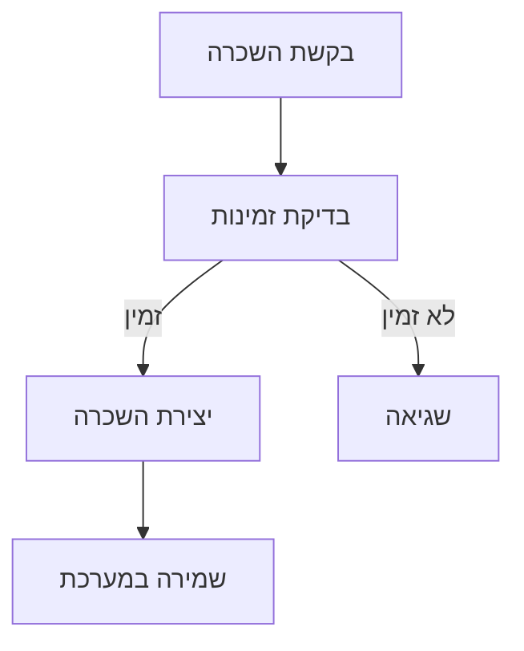
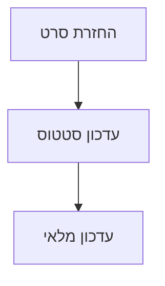

# תיעוד Business Logic, Admin & AI Bot - CineMate

## 🎬 שירותי סרטים (movie_service.py)
- ניהול מידע על סרטים
- פונקציות:
  * `get_movie_details()`: פרטי סרט
  * `search_movies()`: חיפוש סרטים
  * `get_recommendations()`: המלצות אישיות
  * `update_movie()`: עדכון פרטי סרט
  * `delete_movie()`: מחיקת סרט
- אינטגרציה עם TMDB API לקבלת מידע

### הסבר מפורט על השירות:
1. **אינטגרציה עם TMDB**:
   - חיבור ל-API חיצוני
   - תמיכה בשפה העברית
   - המרת נתונים למודל מקומי

2. **פונקציונליות**:
   - קבלת סרטים פופולריים
   - חיפוש לפי מילות מפתח
   - דירוג וביקורות

## 📚 Imports נדרשים

### Service Imports
```python
from flask import current_app
from sqlalchemy import and_, or_, desc
from datetime import datetime, timedelta
import requests
import json
from typing import List, Optional

# Local imports
from app.models import Movie, Rental, User, Review
from app import db
```

## 🎬 שירותי סרטים (movie_service.py)

### פונקציות עיקריות
```python
class MovieService:
    def __init__(self):
        self.tmdb_api_key = current_app.config['TMDB_API_KEY']
        self.tmdb_base_url = 'https://api.themoviedb.org/3'
    
    def get_movie_details(self, movie_id: int) -> Optional[Movie]:
        """קבלת פרטי סרט מלאים"""
        movie = Movie.query.get_or_404(movie_id)
        if not movie.tmdb_id:
            return movie
            
        # השלמת מידע מ-TMDB
        url = f"{self.tmdb_base_url}/movie/{movie.tmdb_id}"
        response = requests.get(url, params={'api_key': self.tmdb_api_key})
        if response.ok:
            tmdb_data = response.json()
            movie.description = tmdb_data.get('overview')
            movie.poster_url = f"https://image.tmdb.org/t/p/w500{tmdb_data.get('poster_path')}"
        return movie
    
    def search_movies(self, query: str, page: int = 1) -> List[Movie]:
        """חיפוש סרטים לפי מילות מפתח"""
        return Movie.query.filter(
            or_(
                Movie.title.ilike(f'%{query}%'),
                Movie.description.ilike(f'%{query}%')
            )
        ).paginate(page=page, per_page=12)
    
    def get_recommendations(self, user_id: int) -> List[Movie]:
        """קבלת המלצות סרטים מותאמות אישית"""
        # בדיקת היסטוריית צפייה
        user_rentals = Rental.query.filter_by(user_id=user_id).all()
        watched_genres = set()
        for rental in user_rentals:
            movie = Movie.query.get(rental.movie_id)
            watched_genres.update(movie.genres)
        
        # מציאת סרטים דומים
        return Movie.query.filter(
            Movie.genres.overlap(watched_genres)
        ).order_by(desc(Movie.rating)).limit(10).all()
```

## 📦 שירותי השכרות (rental_service.py)
- ניהול השכרות סרטים
- פונקציות:
  * `create_rental()`: יצירת השכרה חדשה
  * `get_user_rentals()`: השכרות של משתמש
  * `check_availability()`: בדיקת זמינות סרט
  * `return_movie()`: החזרת סרט

### הסבר על מערכת ההשכרות:
1. **תהליך השכרה**:
   - בדיקת זמינות אוטומטית
   - הגדרת תאריכי השכרה

2. **החזרת סרטים**:
   - עדכון סטטוס אוטומטי

### פונקציות עיקריות
```python
class RentalService:
    def create_rental(self, user_id: int, movie_id: int) -> Optional[Rental]:
        """יצירת השכרה חדשה"""
        # בדיקת זמינות
        movie = Movie.query.get_or_404(movie_id)
        if not movie.is_available:
            return None
            
        # יצירת השכרה
        rental = Rental(
            user_id=user_id,
            movie_id=movie_id,
            rental_date=datetime.utcnow(),
            return_date=datetime.utcnow() + timedelta(days=7)
        )
        db.session.add(rental)
        db.session.commit()
        
        return rental
    
    def return_movie(self, rental_id: int) -> None:
        """החזרת סרט"""
        rental = Rental.query.get_or_404(rental_id)
        rental.returned = True
        rental.actual_return_date = datetime.utcnow()
        
        db.session.commit()
```

## 📱 שירותי מייל

### 1. איפוס סיסמה
```python
def send_password_reset(user_email):
    """
    שולח מייל עם קישור לאיפוס סיסמה
    """
    token = generate_reset_token(user_email)
    send_password_reset_email(user_email, token)
```

## 👨‍💼 ממשק ניהול

### Routes
```python
@admin_bp.route('/dashboard')
@login_required_admin
def admin_dashboard():
    """דף הבית של מנהל המערכת"""
    stats = {
        'total_users': User.query.count(),
        'total_movies': Movie.query.count(),
        'active_rentals': Rental.query.filter_by(returned=False).count()
    }
    return render_template('admin/dashboard_admin.html', stats=stats)

@admin_bp.route('/movies/edit/<int:movie_id>', methods=['GET', 'POST'])
@login_required_admin
def edit_movie(movie_id):
    """עריכת פרטי סרט"""
    movie = Movie.query.get_or_404(movie_id)
    form = MovieForm(obj=movie)
    
    if form.validate_on_submit():
        form.populate_obj(movie)
        db.session.commit()
        flash('הסרט עודכן בהצלחה', 'success')
        return redirect(url_for('admin.movies_list'))
        
    return render_template('admin/edit_movie.html', form=form, movie=movie)
```

## 🔑 נקודות חשובות לזכור
1. **ארכיטקטורה**:
   * הפרדה בין שירותים
   * תבנית Repository
   * Dependency Injection
   * שימוש ב-async/await

2. **אינטגרציות**:
   * TMDB API

3. **ביצועים**:
   * Caching של תוצאות
   * Batch processing
   * אופטימיזציה של שאילתות
   * ניהול משאבים

4. **תחזוקה**:
   * לוגים מפורטים
   * טיפול בשגיאות
   * בדיקות אוטומטיות
   * תיעוד מקיף

## 🤖 בוט AI

### מערכת הצ'אטבוט החכם:
1. **ארכיטקטורה**:
   - שימוש במודל Mistral AI
   - מערכת זיכרון לשמירת היסטוריית שיחה
   - אינטגרציה עם Flask דרך REST API

2. **יכולות הבוט**:
   - המלצות סרטים מותאמות אישית
   - מענה על שאלות על סרטים, שחקנים ובמאים
   - שמירת היסטוריית שיחה (3 הודעות אחרונות)
   - תמיכה באימוג'ים לחוויית משתמש משופרת

3. **אופטימיזציות ביצועים**:
   ```python
   model_config = {
       "temperature": 0.1,     # תשובות מדויקות
       "num_ctx": 512,        # זיכרון מותאם
       "num_predict": 100,    # אורך תשובה
       "num_thread": 8        # ריבוי ליבות
   }
   ```

4. **מאפייני תשובות**:
   - תשובות באנגלית בלבד
   - 2-3 משפטים לכל היותר
   - תגובה מהירה (פחות מ-5 שניות)
   - שילוב אימוג'ים רלוונטיים
   - ציון שנים מדויקות לסרטים

5. **טיפול בשגיאות**:
   - לוגים מפורטים של שגיאות
   - הודעות שגיאה ידידותיות למשתמש
   - מנגנון התאוששות אוטומטי

6. **שימוש בקוד**:
   ```python
   # יצירת מופע של הבוט
   chatbot = MovieChatbot()
   
   # קבלת תשובה
   response = chatbot.get_response("מה דעתך על טיטאניק?")
   # -> "🚢 Titanic (1997) is a cinematic masterpiece..."
   ```

### תרשים זרימה של הבוט:
```
שאלת משתמש -> בדיקת תקינות -> טעינת היסטוריה -> עיבוד AI -> עיצוב תשובה -> החזרה למשתמש
```

# מדריך Business Logic למתחילים - CineMate 🎬

## 📁 מבנה השירותים

```
app/services/
├── movie_service.py    # ניהול סרטים
├── rental_service.py   # ניהול השכרות
└── user_service.py     # ניהול משתמשים
```

## 🎥 שירות סרטים (movie_service.py)

### 1. ניהול מאגר סרטים
```python
class MovieService:
    def get_popular_movies(self, limit=10):
        """קבלת סרטים פופולריים"""
        return Movie.query\
            .join(Review)\
            .group_by(Movie.id)\
            .order_by(func.avg(Review.rating).desc())\
            .limit(limit)\
            .all()
    
    def search_movies(self, query, filters=None):
        """חיפוש סרטים"""
        movies = Movie.query
        
        # חיפוש לפי שם
        if query:
            movies = movies.filter(Movie.title.ilike(f'%{query}%'))
        
        # פילטרים נוספים
        if filters:
            if 'genre' in filters:
                movies = movies.filter(Movie.genre == filters['genre'])
            if 'year' in filters:
                movies = movies.filter(Movie.year == filters['year'])
        
        return movies.all()
    
    def get_movie_details(self, movie_id):
        """קבלת פרטי סרט מלאים"""
        movie = Movie.query.get_or_404(movie_id)
        return {
            'details': movie,
            'reviews': movie.reviews,
            'average_rating': self._calculate_rating(movie),
            'availability': self._check_availability(movie)
        }
```

**איך זה עובד?**
1. `get_popular_movies`: מביא סרטים לפי דירוג ממוצע
2. `search_movies`: מחפש סרטים לפי טקסט ופילטרים
3. `get_movie_details`: מביא את כל המידע על סרט ספציפי

## 🎟️ שירות השכרות (rental_service.py)

### 1. ניהול השכרות
```python
class RentalService:
    def create_rental(self, user_id, movie_id, rental_days=3):
        """יצירת השכרה חדשה"""
        # בדיקת זמינות
        if not self._is_movie_available(movie_id):
            raise MovieNotAvailableError("הסרט אינו זמין להשכרה")
        
        # חישוב תאריכים
        start_date = datetime.now()
        end_date = start_date + timedelta(days=rental_days)
        
        # יצירת השכרה
        rental = Rental(
            user_id=user_id,
            movie_id=movie_id,
            start_date=start_date,
            end_date=end_date,
            status='active'
        )
        
        # שמירה במסד נתונים
        db.session.add(rental)
        db.session.commit()
        
        return rental
    
    def get_active_rentals(self, user_id):
        """קבלת השכרות פעילות"""
        return Rental.query\
            .filter_by(user_id=user_id, status='active')\
            .all()
    
    def return_movie(self, rental_id):
        """החזרת סרט"""
        rental = Rental.query.get_or_404(rental_id)
        
        # עדכון סטטוס
        rental.status = 'returned'
        rental.actual_return_date = datetime.now()
        
        db.session.commit()
        return rental
```

**תהליך השכרה מלא:**
1. בדיקה אם הסרט זמין
2. יצירת רשומת השכרה
3. מעקב אחרי החזרות

## 👥 שירות משתמשים (user_service.py)

### 1. ניהול משתמשים
```python
class UserService:
    def register_user(self, username, email, password):
        """הרשמת משתמש חדש"""
        # בדיקה אם המשתמש קיים
        if User.query.filter_by(email=email).first():
            raise UserExistsError("כתובת האימייל כבר רשומה")
        
        # יצירת משתמש חדש
        user = User(username=username, email=email)
        user.set_password(password)
        
        # שמירה במסד נתונים
        db.session.add(user)
        db.session.commit()
        
        return user
    
    def update_profile(self, user_id, data):
        """עדכון פרטי משתמש"""
        user = User.query.get(user_id)
        
        # עדכון שדות מותרים
        allowed_fields = ['username', 'bio']
        for field in allowed_fields:
            if field in data:
                setattr(user, field, data[field])
        
        db.session.commit()
        return user
    
    def get_rental_history(self, user_id):
        """היסטוריית השכרות"""
        return Rental.query\
            .filter_by(user_id=user_id)\
            .order_by(Rental.start_date.desc())\
            .all()
```

**פעולות מרכזיות:**
1. הרשמת משתמשים חדשים
2. עדכון פרטי פרופיל
3. מעקב אחר היסטוריית השכרות

##  תהליכים עסקיים מרכזיים

### 1. תהליך השכרת סרט


### 2. תהליך החזרת סרט


## 🚫 טיפול בשגיאות ואימות

### 1. הגדרת שגיאות מותאמות
```python
class MovieError(Exception):
    """Base exception for movie-related errors"""
    pass

class MovieNotFoundError(MovieError):
    """Raised when a movie is not found"""
    pass

class RentalError(Exception):
    """Base exception for rental-related errors"""
    pass

class MovieNotAvailableError(RentalError):
    """Raised when trying to rent an unavailable movie"""
    pass
```

### 2. אימות נתונים
```python
from marshmallow import Schema, fields, validates, ValidationError

class MovieSchema(Schema):
    title = fields.Str(required=True)
    release_date = fields.Date(required=True)
    duration = fields.Int(required=True)
    
    @validates('duration')
    def validate_duration(self, value):
        if value <= 0:
            raise ValidationError('אורך הסרט חייב להיות חיובי')
```

### 3. טיפול בשגיאות בשירותים
```python
class MovieService:
    def get_movie_details(self, movie_id: int) -> dict:
        try:
            movie = Movie.query.get(movie_id)
            if not movie:
                raise MovieNotFoundError(f'סרט עם מזהה {movie_id} לא נמצא')
                
            schema = MovieSchema()
            return schema.dump(movie)
            
        except SQLAlchemyError as e:
            log_error('database_error', str(e))
            raise DatabaseError('שגיאה בגישה למסד הנתונים')
```

### 4. טיפול בשגיאות ברמת ה-API
```python
@app.errorhandler(MovieError)
def handle_movie_error(error):
    return jsonify({
        'error': 'שגיאת סרט',
        'message': str(error)
    }), 400

@app.errorhandler(ValidationError)
def handle_validation_error(error):
    return jsonify({
        'error': 'שגיאת אימות',
        'messages': error.messages
    }), 422
```

2. **ביצועים ואופטימיזציה**
   - **שימוש ב-Caching**:
     ```python
     from functools import lru_cache
     
     class MovieService:
         @lru_cache(maxsize=100)
         def get_movie_details(self, movie_id: int) -> dict:
             """Get movie details with caching"""
             movie = Movie.query.get_or_404(movie_id)
             return {
                 'details': movie,
                 'reviews': movie.reviews,
                 'rating': self._calculate_rating(movie)
             }
     ```
   - **אופטימיזציה של שאילתות**:
     ```python
     # טעינה מראש של נתונים קשורים
     movies = Movie.query.options(
         joinedload(Movie.reviews),
         joinedload(Movie.genres)
     ).all()
     ```
   - **שימוש ב-Bulk Operations**:
     ```python
     def update_movie_ratings(self, movie_ids: List[int], new_rating: float):
         Movie.query.filter(Movie.id.in_(movie_ids)).update(
             {Movie.rating: new_rating},
             synchronize_session=False
         )
         db.session.commit()
     ```

3. **אבטחה והרשאות**
   - **בדיקת הרשאות משתמש**:
     ```python
     from functools import wraps
     
     def admin_required(f):
         @wraps(f)
         def decorated_function(*args, **kwargs):
             if not current_user.is_admin:
                 abort(403)
             return f(*args, **kwargs)
         return decorated_function
     ```
   - **הצפנת מידע רגיש**:
     ```python
     from werkzeug.security import generate_password_hash
     
     def save_payment_info(user_id: int, card_info: dict):
         # הצפנת פרטי כרטיס אשראי
         encrypted_card = encrypt_sensitive_data(card_info)
         user = User.query.get(user_id)
         user.payment_info = encrypted_card
         db.session.commit()
     ```
   - **תיעוד פעולות**:
     ```python
     def log_action(action_type: str, user_id: int, details: dict):
         """Log important system actions"""
         log_entry = SystemLog(
             action_type=action_type,
             user_id=user_id,
             details=json.dumps(details),
             timestamp=datetime.utcnow()
         )
         db.session.add(log_entry)
         db.session.commit()
     ```
