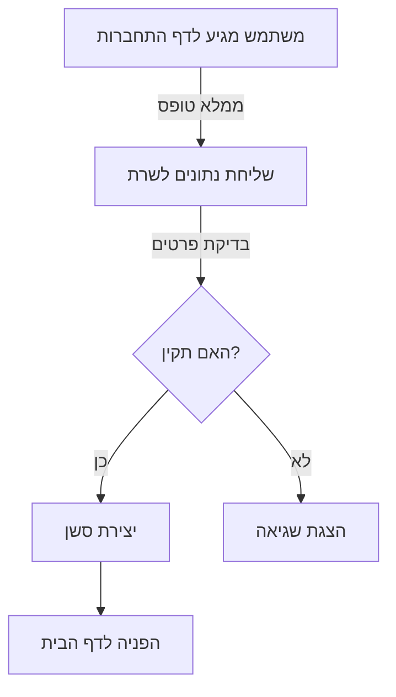
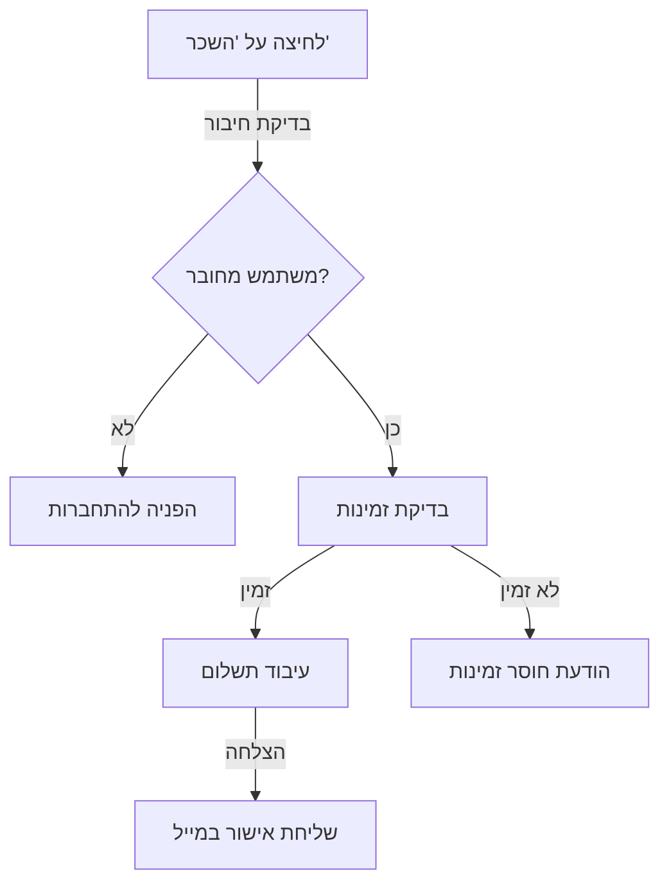

# תיעוד Frontend מפורט - CineMate

## 📚 הסבר על הספריות והתלויות

### ספריות Python הנדרשות
```python
from flask import render_template, url_for, flash, redirect
from flask_login import current_user, login_required
from werkzeug.security import generate_password_hash
from datetime import datetime
```

**הסבר מפורט על כל ספרייה:**
- `render_template`: משמש לרינדור של תבניות HTML. מאפשר לנו להעביר משתנים מהשרת לתבנית
- `url_for`: יוצר כתובות URL דינמיות. במקום לכתוב את הנתיב באופן קשיח, הפונקציה מייצרת אותו באופן דינמי
- `flash`: מערכת להצגת הודעות למשתמש (הצלחה, שגיאה, אזהרה)
- `current_user`: מכיל את פרטי המשתמש המחובר כרגע
- `login_required`: דקורטור שמגן על דפים שדורשים הרשאות

### ספריות JavaScript
```html
<!-- Bootstrap 5 -->
<script src="https://cdn.jsdelivr.net/npm/bootstrap@5.1.3/dist/js/bootstrap.bundle.min.js"></script>
<!-- משמש לעיצוב ורספונסיביות -->

<!-- jQuery -->
<script src="https://code.jquery.com/jquery-3.6.0.min.js"></script>
<!-- נדרש לפעולות AJAX ומניפולציות על הדום -->
```

**למה אנחנו משתמשים בכל ספרייה?**
- **Bootstrap 5**: 
  * מספק רכיבי UI מוכנים מראש
  * מערכת Grid לפריסה רספונסיבית
  * עיצוב אחיד וקונסיסטנטי
  * תמיכה מובנית ב-RTL

- **jQuery**: 
  * פישוט פעולות AJAX
  * מניפולציות על ה-DOM
  * תאימות בין דפדפנים
  * אנימציות וטרנזיציות

## 🎨 מבנה התבניות

### base.html - תבנית הבסיס (תבנית האב)
```html
<!DOCTYPE html>
<html lang="he" dir="rtl">
<head>
    <!-- Meta Tags חשובים להגדרת המסמך -->
    <meta charset="UTF-8">  <!-- תמיכה בעברית ובתווים מיוחדים -->
    <meta name="viewport" content="width=device-width, initial-scale=1.0">  <!-- תמיכה במכשירים ניידים -->
    
    <!-- קישורים לקבצי העיצוב הראשיים -->
    <link rel="stylesheet" href="{{ url_for('static', filename='css/main.css') }}">  <!-- עיצובים בסיסיים -->
    <link rel="stylesheet" href="{{ url_for('static', filename='css/responsive.css') }}">  <!-- עיצובים למסכים שונים -->
    
    <!-- ספריות חיצוניות נדרשות -->
    <link href="https://cdn.jsdelivr.net/npm/bootstrap@5.1.3/dist/css/bootstrap.rtl.min.css" rel="stylesheet">  <!-- Bootstrap RTL -->
    <link href="https://cdnjs.cloudflare.com/ajax/libs/font-awesome/6.0.0/css/all.min.css" rel="stylesheet">  <!-- אייקונים -->
</head>
<body>
    <!-- תפריט הניווט הראשי - משותף לכל הדפים -->
    
    
    <!-- אזור התוכן הדינמי - כל דף יזריק לכאן את התוכן שלו -->
    <main class="container mt-4">
        
    </main>
    
    <!-- סקריפטים נדרשים בסוף הדף לטעינה מהירה יותר -->
    <script src="https://cdn.jsdelivr.net/npm/bootstrap@5.1.3/dist/js/bootstrap.bundle.min.js"></script>
    <script src="https://code.jquery.com/jquery-3.6.0.min.js"></script>
    <script src="{{ url_for('static', filename='js/main.js') }}"></script>
</body>
</html>
```

**הסבר על מבנה התבנית:**
1. **Meta Tags**:
   - `charset="UTF-8"`: תמיכה בעברית ותווים מיוחדים
   - `viewport`: התאמה למכשירים ניידים
   - `dir="rtl"`: תמיכה בכיווניות מימין לשמאל

2. **קבצי CSS**:
   - `main.css`: סגנונות בסיסיים
   - `responsive.css`: התאמות למסכים שונים

3. **מבנה הדף**:
   - תפריט ניווט משותף לכל הדפים
   - אזור תוכן דינמי שמשתנה בין הדפים
   - footer קבוע בתחתית

## 🔒 דפי אימות והרשמה

### register.html - טופס הרשמה
```html



<form method="POST" action="{{ url_for('auth.register') }}" class="form-register">
    {{ form.hidden_tag() }}  <!-- הגנת CSRF -->
    
    <!-- שדות הרשמה -->
    <div class="form-group">
        {{ form.username.label }}
        {{ form.username(class="form-control") }}
        
            <span class="text-danger">{{ error }}</span>
        
    </div>
</form>

```

**הסבר על רכיבי הטופס:**
1. **CSRF הגנה**:
   - `form.hidden_tag()`: מוסיף token נסתר להגנה מפני התקפות CSRF
   - Token זה מאומת בצד שרת

2. **ולידציה**:
   - בדיקות בצד לקוח עם JavaScript
   - בדיקות בצד שרת עם WTForms
   - הצגת שגיאות בצורה ברורה למשתמש

3. **עיצוב**:
   - שימוש ב-Bootstrap classes
   - התאמה לתצוגה במובייל
   - הנגשה לקוראי מסך

## 📱 פונקציות JavaScript

### main.js - פונקציות ראשיות
```javascript
// טעינת סרטים בדף הראשי
async function loadMovies(page = 1) {
    try {
        const response = await fetch(`/api/movies?page=${page}`);
        const data = await response.json();
        renderMovies(data.movies);
    } catch (error) {
        console.error('Error:', error);
        showErrorMessage('טעינת הסרטים נכשלה');
    }
}
```

**הסבר על הפונקציות:**
1. **טעינת סרטים**:
   - שימוש ב-Fetch API לבקשות AJAX
   - טיפול בשגיאות והצגתן למשתמש
   - רינדור דינמי של תוצאות

2. **חיפוש בזמן אמת**:
   - שימוש ב-debounce למניעת בקשות מיותרות
   - עדכון תוצאות בזמן אמת
   - הצגת אנימציית טעינה

## 🧩 רכיבים משותפים

### movie_card.html - כרטיס סרט
```html

<div class="movie-card">
    <!-- תמונת הסרט -->
    <div class="movie-poster">
        
        
            <span class="badge bg-success">חדש</span>
        
    </div>
    
    <!-- פרטי הסרט -->
    <div class="movie-details">
        <h3>{{ movie.title }}</h3>
        <p class="movie-rating">
            <i class="fas fa-star"></i>
            {{ "%.1f"|format(movie.rating) }}
        </p>
    </div>
</div>

```

**הסבר על הרכיב:**
1. **מבנה**:
   - שימוש ב-macro של Jinja2 לשימוש חוזר
   - הפרדה בין תמונה לפרטים
   - תמיכה בתגיות מיוחדות (חדש, מבצע)

2. **פונקציונליות**:
   - טעינה עצלה של תמונות
   - אינטראקציה עם רשימת המועדפים
   - קישור לדף פרטי הסרט

## 🎬 תבניות עיקריות

### movies_list.html - רשימת הסרטים
```html



<h2 class="text-center my-4">📽 רשימת סרטים</h2>
<div class="row">
    
    <div class="col-md-4">
        <div class="card mb-4 shadow-sm">
            
            <div class="card-body text-center">
                <h5 class="card-title">{{ movie.title }}</h5>
                <p class="card-text">
                    <strong>ז'אנר:</strong> {{ movie.genre }}<br>
                    <strong>שנה:</strong> {{ movie.year }}
                </p>
                <form method="post" action="{{ url_for('main.rent_movie', movie_id=movie.movie_id) }}">
                    <button type="submit" class="btn btn-outline-primary btn-sm">🎟 השכר עכשיו</button>
                </form>
            </div>
        </div>
    </div>
    
</div>

```

**הסבר על תבנית רשימת הסרטים:**
1. **מבנה כללי**:
   - שימוש בתצוגת רשת (Grid) של Bootstrap
   - כל סרט מוצג ככרטיס (Card) עם צל
   - תמונות בגודל אחיד עם התאמה אוטומטית

2. **רכיבי הכרטיס**:
   - תמונת הסרט עם כיסוי מלא
   - כותרת הסרט במרכז
   - פרטי ז'אנר ושנה
   - כפתור השכרה מודגש

3. **אינטראקציה**:
   - טופס השכרה מובנה בכל כרטיס
   - שליחת בקשת POST לנתיב הנכון
   - עיצוב תואם לשפה העברית

### movie_details.html - פרטי סרט
```html



<div class="container mt-5">
    <div class="row">
        <div class="col-md-4">
            
        </div>
        <div class="col-md-8">
            <h1 class="mb-4">{{ movie.title }}</h1>
            <div class="movie-details">
                <p><strong>ז'אנר:</strong> {{ movie.genre }}</p>
                <p><strong>שנה:</strong> {{ movie.year }}</p>
                <p><strong>תיאור:</strong> {{ movie.description }}</p>
            </div>
            <div class="mt-4 d-flex gap-2">
                
                <form method="POST" action="{{ url_for('main.rent_movie', movie_id=movie.movie_id) }}">
                    <button type="submit" class="btn btn-primary">השכר סרט</button>
                </form>
                
                <a href="{{ url_for('main.dashboard') }}" class="btn btn-outline-light">⬅ חזור לדשבורד</a>
            </div>
        </div>
    </div>
</div>

```

**הסבר על תבנית פרטי הסרט:**
1. **פריסת המסך**:
   - חלוקה לשני טורים: תמונה ופרטים
   - תמונה גדולה ברזולוציה גבוהה
   - מרווחים נוחים לקריאה

2. **תצוגת מידע**:
   - כותרת בולטת
   - פרטי הסרט מאורגנים בצורה ברורה
   - תיאור מלא של הסרט

3. **אינטראקציה וניווט**:
   - כפתור השכרה למשתמשים מחוברים בלבד
   - כפתור חזרה לדשבורד
   - עיצוב מותאם למובייל

## 📱 עיצוב רספונסיבי

### responsive.css
```css
/* Mobile First Approach */
.movie-grid {
    display: grid;
    grid-template-columns: 1fr;
    gap: 1rem;
}

/* Tablet */
@media (min-width: 768px) {
    .movie-grid {
        grid-template-columns: repeat(2, 1fr);
    }
}

/* Desktop */
@media (min-width: 1024px) {
    .movie-grid {
        grid-template-columns: repeat(4, 1fr);
    }
}
```

**הסבר על העיצוב הרספונסיבי:**
1. **גישת Mobile First**:
   - התחלה מתצוגת מובייל
   - הוספת מאפיינים למסכים גדולים יותר
   - שימוש ב-CSS Grid לפריסה גמישה

2. **נקודות שבירה**:
   - מובייל: עד 768px
   - טאבלט: 768px-1024px
   - דסקטופ: מעל 1024px

## 🔑 נקודות חשובות למרצה
1. **אבטחה**:
   - הגנת CSRF בכל הטפסים
   - סניטציה של קלט משתמש
   - הצפנת נתונים רגישים

2. **ביצועים**:
   - טעינה עצלה של תמונות
   - מינימום בקשות לשרת
   - דחיסת קבצי CSS ו-JS

3. **נגישות**:
   - תמיכה בקוראי מסך
   - ניגודיות צבעים תקינה
   - מבנה HTML סמנטי

4. **תחזוקתיות**:
   - הפרדה ברורה בין רכיבים
   - קוד מתועד היטב
   - שימוש במשתני CSS

# מדריך Frontend למתחילים - CineMate 🎬

## 📁 מבנה התיקיות

```
frontend/
├── templates/           # כל הדפים של האתר
│   ├── auth/           # דפי התחברות והרשמה
│   ├── movies/         # דפים הקשורים לסרטים
│   ├── user/           # דפי משתמש
│   └── components/     # רכיבים משותפים
├── static/             # קבצים סטטיים
│   ├── css/           # קבצי עיצוב
│   ├── js/            # קבצי JavaScript
│   └── images/        # תמונות
└── forms/             # טפסים
```

## 🌟 איך האתר עובד?

### 1. תהליך טעינת דף
כשאתם נכנסים לדף באתר, קורים הדברים הבאים:
1. הדפדפן שולח בקשה לשרת
2. השרת מעבד את הבקשה ומכין את המידע
3. השרת שולח בחזרה HTML שנוצר מתבנית
4. הדפדפן מציג את הדף ומפעיל את ה-JavaScript

### 2. דוגמה לדף הבית (home.html)
```html
  <!-- תבנית הבסיס -->


<div class="home-page">
    <!-- קופץ ברוך הבא למשתמש מחובר -->
    
        <div class="welcome-message">
            שלום {{ current_user.username }}! 
        </div>
    

    <!-- רשימת סרטים פופולריים -->
    <div class="popular-movies">
        <h2>סרטים פופולריים</h2>
        <div class="movie-grid">
            
                
            
        </div>
    </div>
</div>

```

**הסבר פשוט:**
- ``: אומר "תשתמש בתבנית הבסיסית"
- ``: "כאן מתחיל התוכן הייחודי של הדף הזה"
- ``: בודק אם המשתמש מחובר
- ``: עובר על כל הסרטים ומציג אותם

### 3. רכיב כרטיס סרט (movie_card.html)
```html
<div class="movie-card">
    <!-- תמונת הסרט -->
      <!-- טעינה מושהית לביצועים -->
    
    <!-- פרטי הסרט -->
    <div class="movie-details">
        <h3>{{ movie.title }}</h3>
        <p class="year">{{ movie.release_year }}</p>
        
        <!-- כפתורי פעולה -->
        <div class="actions">
            <button onclick="showDetails({{ movie.id }})">
                פרטים נוספים
            </button>
            
            
                <button onclick="rentMovie({{ movie.id }})">
                    השכר סרט
                </button>
            
        </div>
    </div>
</div>
```

**למה זה חשוב?**
- רכיב שחוזר על עצמו בכל מקום שיש סרטים
- קל לתחזוקה: משנים במקום אחד, משתנה בכל מקום
- תומך בהרשאות: כפתורים שונים למשתמש מחובר

### 4. טופס חיפוש (search_form.html)
```html
<form class="search-form" method="GET" action="{{ url_for('movies.search') }}">
    <div class="search-input">
        <input type="text" 
               name="query" 
               placeholder="חפש סרטים..."
               value="{{ request.args.get('query', '') }}"
               oninput="handleSearch(this.value)">
        
        <button type="submit">
            <i class="fas fa-search"></i>
        </button>
    </div>
    
    <!-- פילטרים מתקדמים -->
    <div class="advanced-filters">
        <select name="genre">
            <option value="">כל הז'אנרים</option>
            
                <option value="{{ genre.id }}">
                    {{ genre.name }}
                </option>
            
        </select>
        
        <select name="year">
            <option value="">כל השנים</option>
            
                <option value="{{ year }}">
                    {{ year }}
                </option>
            
        </select>
    </div>
</form>
```

**איך זה עובד?**
1. כשהמשתמש מקליד, `handleSearch()` מופעל
2. הפונקציה שולחת בקשת AJAX לשרת
3. השרת מחזיר תוצאות חיפוש
4. JavaScript מעדכן את התצוגה בזמן אמת

### 5. JavaScript לחיפוש (search.js)
```javascript
// חיפוש בזמן אמת
async function handleSearch(query) {
    if (query.length < 2) return;  <!-- מחכים ל-2 תווים לפחות -->
    
    try {
        // מראים אנימציית טעינה
        showLoading();
        
        // שולחים בקשה לשרת
        const response = await fetch(`/api/movies/search?q=${query}`);
        const results = await response.json();
        
        // מציגים תוצאות
        displayResults(results);
        
    } catch (error) {
        showError("מצטערים, החיפוש נכשל");
    } finally {
        hideLoading();
    }
}

// הצגת תוצאות החיפוש
function displayResults(movies) {
    const container = document.querySelector('.search-results');
    
    if (movies.length === 0) {
        container.innerHTML = '<p>לא נמצאו תוצאות</p>';
        return;
    }
    
    container.innerHTML = movies.map(movie => `
        <div class="movie-result">
            
            <div class="details">
                <h3>${movie.title}</h3>
                <p>${movie.year}</p>
            </div>
        </div>
    `).join('');
}
```

### 6. עיצוב רספונסיבי (styles.css)
```css
/* בסיס: מובייל תחילה */
.movie-grid {
    display: grid;
    grid-template-columns: 1fr;  <!-- עמודה אחת -->
    gap: 1rem;
    padding: 1rem;
}

/* טאבלט */
@media (min-width: 768px) {
    .movie-grid {
        grid-template-columns: repeat(2, 1fr);  <!-- 2 עמודות -->
    }
}

/* מחשב */
@media (min-width: 1024px) {
    .movie-grid {
        grid-template-columns: repeat(4, 1fr);  <!-- 4 עמודות -->
    }
}

/* כרטיס סרט */
.movie-card {
    border-radius: 8px;
    overflow: hidden;
    box-shadow: 0 2px 4px rgba(0,0,0,0.1);
    transition: transform 0.2s;
}

.movie-card:hover {
    transform: translateY(-5px);
}

/* נגישות */
@media (prefers-reduced-motion: reduce) {
    .movie-card {
        transition: none;
    }
}
```

## 🔄 תהליכים מרכזיים

### 1. תהליך התחברות


### 2. תהליך השכרת סרט


## 🔗 קישורים חשובים בין הקבצים

1. **base.html ← כל הדפים**
   - תבנית בסיס שכולם יורשים ממנה
   - מכילה תפריט, footer, וסקריפטים משותפים

2. **components/ ← דפי תוכן**
   - רכיבים שחוזרים על עצמם
   - למשל: כרטיס סרט, תפריט, טופס חיפוש

3. **static/js/ ← templates/**
   - קבצי JavaScript שמפעילים את הדפים
   - מתחברים דרך תגיות script בתבניות

## 📝 טיפים למתחילים

1. **הבנת Jinja2**
   - `{{ }}` - להצגת משתנה
   - `` - לוגיקה (if, for, וכו')
   - `{# #}` - הערות שלא מוצגות

2. **עבודה עם JavaScript**
   - תמיד לבדוק אם האלמנט קיים לפני שימוש
   - להשתמש ב-try/catch לטיפול בשגיאות
   - לא לשכוח loading states

3. **CSS**
   - להתחיל ממובייל (Mobile First)
   - להשתמש במשתנים ל-colors, spacing
   - לזכור נגישות (contrast, motion)
